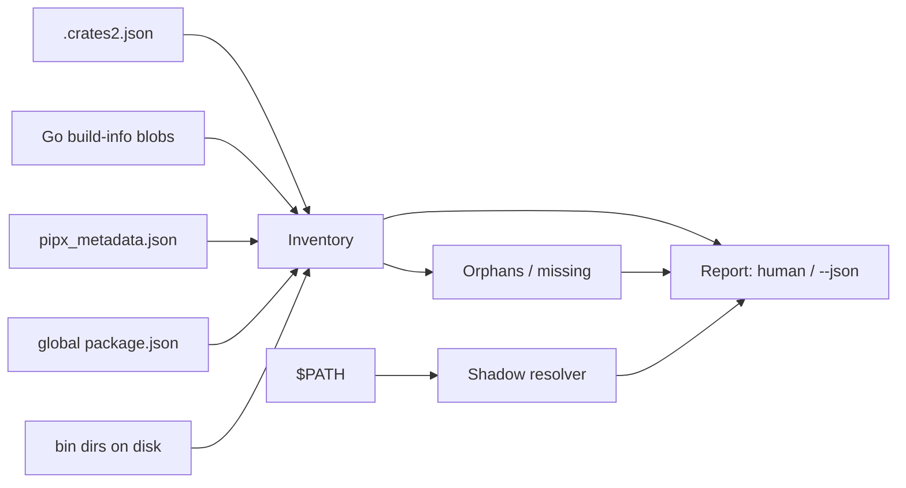

# binsweep

[English](README.md) | [中文](README.zh.md) | [日本語](README.ja.md)

[](LICENSE) [](Cargo.toml)  [](CONTRIBUTING.md)

**cargo・go・pipx・npm のグローバル開発バイナリを棚卸しするオープンソースツール — 出所の特定、陳腐化検出、PATH シャドーイング検出を 1 つのレポートに。**


```bash
git clone https://github.com/JaydenCJ/binsweep.git && cargo install --path binsweep
```

> プレリリース：crates.io にはまだ未公開のため、上記の手順でソースからインストールしてください。ランタイム依存ゼロ — バイナリは std のみです。

## なぜ binsweep か？

長年の `cargo install`、`go install`、`pipx install`、`npm i -g` は、あらゆる開発者の bin ディレクトリをゴミ埋立地に変えます：誰も入れた覚えのない謎の実行ファイル、削除済み venv を指すランチャー、そして同じツールの 2 バージョン — PATH で先にある方が黙って勝ちます。各エコシステム純正の一覧コマンドは自分の島しか見えず — `cargo install --list` は npm も配った `rg` のことを何も知りません — しかも*実際に走るのはどれか*を教えてくれるものは 1 つもありません。binsweep は 4 つのエコシステムが元々書き出しているマニフェスト（`.crates2.json`、各 Go バイナリに埋め込まれた build-info ブロブ、`pipx_metadata.json`、`package.json`）を読み、ディスク上の実体と突き合わせ、1 つのレポートを出します：各バイナリを誰が入れたか、どれだけ古いか、誰にも所有されていないものは何か、何が何を隠しているか。読み取り専用 — 書き込みも削除もネットワーク接続も一切行いません。

|  | binsweep | 純正一覧コマンド¹ | `which -a` | `ls` + 当て推量 |
|---|---|---|---|---|
| エコシステム横断の単一レポート | あり | なし（各自の島のみ） | なし（名前のみ） | なし |
| 出所特定（パッケージ・バージョン・入手元） | あり | 自分のエコシステムのみ | なし | なし |
| 孤児検出（所有者不明のバイナリ） | あり | なし | なし | 手作業 |
| 欠損検出（記録はあるがファイルなし） | あり | なし | なし | なし |
| PATH シャドーイング（勝者を先頭に） | あり | なし | 出現箇所のみ | なし |
| 陳腐化フラグ | あり（`--stale 1y`） | なし | なし | `ls -l` を凝視 |
| 各ツールチェーンの導入が必要 | 不要 — ファイルを直接読む | 必要（それぞれ） | 不要 | 不要 |
| 機械可読な出力 | あり（`--json`） | まちまち | なし | なし |

<sub>¹ `cargo install --list`・`go version -m`・`pipx list`・`npm ls -g` — 4 コマンド 4 フォーマットで、`go version -m` はマシンに Go ツールチェーンを要求します。cargo 1.79 / go 1.22 / pipx 1.6 / npm 10 の出力に対して検証、2026-07。</sub>

## 特長

- **4 エコシステムを 1 レポートに** — cargo・Go・pipx・npm のグローバルインストールを一度のスキャンで走査し、各バイナリをパッケージ・バージョン・入手元（`crates.io`・`git`・`path`・モジュールパス・venv・registry）に帰属させます。
- **Go なしで Go の出所を特定** — Go リンカが全実行ファイルに埋め込む build-info ブロブをファイルのバイト列から直接デコードするため、Go ツールチェーンのないマシンでも `~/go/bin` にモジュールパスとバージョンが付きます。
- **孤児を名指しで晒す** — どのマニフェストも所有しない実行ファイル、削除済み pipx venv を指すランチャー、パッケージが消えた npm リンク、`~/.local/bin` で化石化した無主のスクリプトを、理由付きですべて列挙します。
- **シャドーイングは列挙でなく裁定** — 複数の PATH ディレクトリに同名で存在するコマンドを勝者先頭で報告し、`binsweep which <name>` は導入済みだが PATH から届かないものも含め、1 つの名前の全提供元を説明します。
- **陳腐化のしきい値は自分で決める** — `--stale 90d`/`6mo`/`1y` がしきい値を超えて放置されたバイナリにフラグを立てます。時計ずれによる未来の mtime は決してカウントしません。
- **安全でスクリプト向き** — 設計から読み取り専用、ネットワークなし、テレメトリなし。機械には `--json`、CI や dotfile チェックには孤児・欠損・シャドーで 1 終了する `--strict` を。

## クイックスタート

インストール（Rust 1.75+ が必要）：

```bash
git clone https://github.com/JaydenCJ/binsweep.git && cargo install --path binsweep
```

マシンを掃除して、1 年間放置されたものにフラグを：

```bash
binsweep scan --stale 1y
```

出力（同梱 fixture から取得 — `bash examples/fixture.sh`）：

```text
cargo · /tmp/binsweep-fixture/home/.cargo/bin — 3 binaries, 2 packages
  NAME    PACKAGE   VERSION ORIGIN    AGE STATUS
  gone    gone-tool 0.3.0   crates.io -   missing
  mystery ?         ?       ?         40d orphan
  rg      ripgrep   14.1.0  crates.io 2y  ok, stale

go · /tmp/binsweep-fixture/home/go/bin — 2 binaries, 1 package
  NAME     PACKAGE             VERSION ORIGIN               AGE   STATUS
  gotool   example.test/gotool v1.6.0  go module (go1.22.4) 300d  ok
  handcopy ?                   ?       ?                    3y 1d orphan, stale

pipx · /tmp/binsweep-fixture/home/.local/bin — 2 binaries, 1 package
  NAME           PACKAGE VERSION ORIGIN    AGE STATUS
  black          black   24.4.2  pipx venv 25d ok
  deploy-2019.sh ?       ?       ?         6y  orphan, stale

npm · /tmp/binsweep-fixture/home/.npm-global/bin — 2 binaries, 1 package
  NAME     PACKAGE    VERSION ORIGIN     AGE STATUS
  tsc      typescript 5.5.3   npm global 80d ok
  tsserver typescript 5.5.3   npm global -   missing

orphans (3)
  cargo /tmp/binsweep-fixture/home/.cargo/bin/mystery — present in bin dir but no cargo install record
  go    /tmp/binsweep-fixture/home/go/bin/handcopy — no Go build info — not built by 'go install'
  pipx  /tmp/binsweep-fixture/home/.local/bin/deploy-2019.sh — file in bin dir with no known package owner

missing (2)
  cargo gone — registered by 'gone-tool' but absent from /tmp/binsweep-fixture/home/.cargo/bin
  npm   tsserver — declared by 'typescript' but not linked in /tmp/binsweep-fixture/home/.npm-global/bin

shadows (1)
  rg: /tmp/binsweep-fixture/home/.cargo/bin/rg wins; shadowed: /tmp/binsweep-fixture/sysbin/rg

summary: 7 binaries · 5 packages · 3 orphans · 2 missing · 1 shadowed name · 3 stale
```

1 つの名前について尋ねる — 誰が提供し、実際に走るのはどのコピーか：

```bash
bash examples/fixture.sh which rg
```

```text
rg — 2 places on PATH
  1. /tmp/binsweep-fixture/home/.cargo/bin/rg  ← active  (cargo · ripgrep 14.1.0)
  2. /tmp/binsweep-fixture/sysbin/rg  shadowed
```

## 事実の出どころ

binsweep は推測しません：レポート内のすべての主張は各エコシステム自身が維持する状態から読み取り、bin ディレクトリと突き合わせています。

| エコシステム | 事実の情報源 | 入手元の値 |
|---|---|---|
| cargo | `$CARGO_HOME/.crates2.json`（フォールバック `.crates.toml`） | `crates.io`・`registry`・`git`・`path`・`rustup proxy` |
| go | `$GOBIN` 内の各実行ファイルに埋め込まれた build-info ブロブ | `go module (goX.Y.Z)` |
| pipx | `$PIPX_HOME/venvs` 内の各 venv の `pipx_metadata.json` | `pipx venv` |
| npm | `<prefix>/lib/node_modules` 内の各パッケージの `package.json` | `npm global` |

各エントリはステータスを持ちます：`ok`（所有者ありでディスク上に存在）、`orphan`（ディスク上にあるが誰も所有しない）、`missing`（記録はあるがファイルが消失）。Go 1.18 より前にビルドされたバイナリは binsweep が追跡しないポインタ式エンコーディングを使うため、誤帰属せず `?` フィールドで正直に報告されます。さらに 2 種類のノイズは設計段階で除去されています：rustup が `~/.cargo/bin` に置くツールチェーンプロキシ（`cargo`・`rustc` など）は孤児扱いせず `rustup` に帰属させ、互いにエイリアスな PATH ディレクトリ（usr-merge ディストリの `/bin` → `/usr/bin`）はシャドウ解析の前に重複排除します。

## オプションと終了コード

ルートは フラグ → 各ツール自身の環境変数 → 慣例 の順で解決され、各ツール本来の挙動と完全に一致します。

| Key | Default | Effect |
|---|---|---|
| `--home <DIR>` | `$HOME` | すべての慣例デフォルトの起点となるホームディレクトリ |
| `--path <PATH>` | `$PATH` | シャドー解析と `which` に使う PATH 文字列 |
| `--cargo-home <DIR>` | `$CARGO_HOME` または `~/.cargo` | 読み取る cargo home |
| `--go-bin <DIR>` | `$GOBIN`・`$GOPATH/bin` または `~/go/bin` | 読み取る Go bin ディレクトリ |
| `--pipx-home <DIR>` | `$PIPX_HOME` または `~/.local/share/pipx` | pipx home（旧 `~/.local/pipx` は自動検出） |
| `--pipx-bin <DIR>` | `$PIPX_BIN_DIR` または `~/.local/bin` | pipx ランチャーディレクトリ |
| `--npm-prefix <DIR>` | `$NPM_CONFIG_PREFIX` または `~/.npm-global` | npm グローバル prefix |
| `--stale <DUR>` | オフ | `DUR` より古いバイナリにフラグ（`h`・`d`・`w`・`mo`・`y`） |
| `--json` | オフ | 機械可読レポート（scan のみ） |
| `--strict` | オフ | 孤児・欠損・シャドーが 1 つでもあれば 1 で終了 |

終了コード：`0` クリーン、`1` `--strict` の検出または `which` が何も見つけず、`2` 使い方エラー。

## アーキテクチャ



## ロードマップ

- [x] コアスイープ：cargo/go/pipx/npm の出所特定、孤児・欠損検出、PATH シャドーイング、陳腐化、JSON レポート、`--strict` 終了コード
- [ ] エコシステム追加として Homebrew と uv tool をサポート
- [ ] `binsweep clean` — 確認済み孤児の対話的削除（デフォルトは引き続き読み取り専用）
- [ ] 完全な ELF/Mach-O セクション走査で Go 1.18 以前のポインタ式 build info を解決
- [ ] Windows サポート（`PATHEXT`・`;` 区切り・`%APPDATA%` npm prefix）

全リストは [open issues](https://github.com/JaydenCJ/binsweep/issues) を参照してください。

## コントリビュート

コントリビュート歓迎です — [CONTRIBUTING.md](CONTRIBUTING.md) を参照し、[good first issue](https://github.com/JaydenCJ/binsweep/issues?q=is%3Aissue+is%3Aopen+label%3A%22good+first+issue%22) から始めるか、[discussion](https://github.com/JaydenCJ/binsweep/discussions) を開いてください。

## ライセンス

[MIT](LICENSE)
