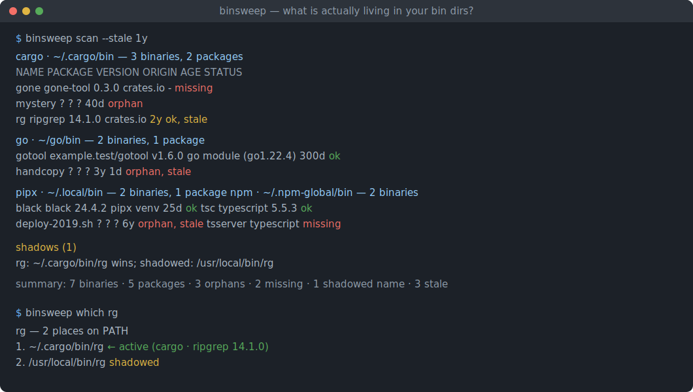
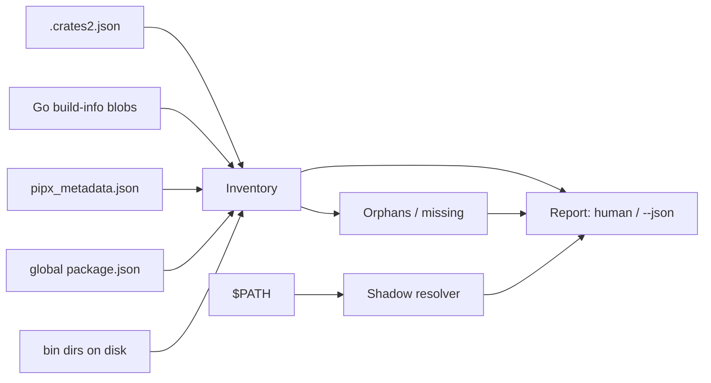

# binsweep

[English](README.md) | [中文](README.zh.md) | [日本語](README.ja.md)

[](LICENSE) [](Cargo.toml)  [](CONTRIBUTING.md)

**Open-source inventory of global dev binaries from cargo, go, pipx and npm — provenance, staleness and PATH-shadowing detection in one report.**



```bash
git clone https://github.com/JaydenCJ/binsweep.git && cargo install --path binsweep
```

> Pre-release: not yet on crates.io; install from source as above. Zero runtime dependencies — the binary is std-only.

## Why binsweep?

Years of `cargo install`, `go install`, `pipx install` and `npm i -g` turn every developer's bin dirs into a landfill: mystery executables nobody remembers installing, launchers pointing at deleted venvs, and two versions of the same tool where whichever is earlier on PATH silently wins. The native listers each see only their own island — `cargo install --list` knows nothing about the `rg` that npm also shipped — and none of them can tell you *which one actually runs*. binsweep reads the manifests all four ecosystems already write (`.crates2.json`, the Go build-info blob embedded in every binary, `pipx_metadata.json`, `package.json`), reconciles them against what actually sits on disk, and produces one report: who installed every binary, how old it is, what nobody claims, and what shadows what. It only ever reads — never a write, delete or network call.

|  | binsweep | native listers¹ | `which -a` | `ls` + guesswork |
|---|---|---|---|---|
| Cross-ecosystem single report | yes | no (one island each) | no (names only) | no |
| Provenance (package, version, source) | yes | own ecosystem only | no | no |
| Orphan detection (unclaimed binaries) | yes | no | no | manual |
| Missing detection (claims with no file) | yes | no | no | no |
| PATH shadowing, winner first | yes | no | occurrences only | no |
| Staleness flagging | yes (`--stale 1y`) | no | no | `ls -l` squinting |
| Needs the toolchains installed | no — reads files directly | yes (each one) | no | no |
| Machine-readable output | yes (`--json`) | varies | no | no |

<sub>¹ `cargo install --list`, `go version -m`, `pipx list`, `npm ls -g` — four commands, four formats, and `go version -m` requires a Go toolchain on the machine. Verified against cargo 1.79 / go 1.22 / pipx 1.6 / npm 10 outputs, 2026-07.</sub>

## Features

- **Four ecosystems, one report** — cargo, Go, pipx and npm global installs scanned in a single pass, each binary attributed to its package, version and source (`crates.io`, `git`, `path`, module path, venv, registry).
- **Go provenance without Go** — binsweep decodes the build-info blob the Go linker embeds in every executable directly from the file bytes, so `~/go/bin` gets module paths and versions even on machines with no Go toolchain.
- **Orphans named and shamed** — executables no manifest claims, launchers pointing into deleted pipx venvs, npm links whose package was removed, and the unowned scripts fossilizing in `~/.local/bin` all get listed with a reason.
- **Shadowing resolved, not just listed** — every name that exists in more than one PATH directory is reported winner-first, and `binsweep which <name>` explains all providers of one name, including installed-but-unreachable ones.
- **Staleness on your terms** — `--stale 90d`/`6mo`/`1y` flags binaries untouched past the threshold; future mtimes from clock skew never count.
- **Safe and scriptable** — read-only by design, no network, no telemetry; `--json` for machines and `--strict` to exit 1 in CI or dotfile checks when anything is orphaned, missing or shadowed.

## Quickstart

Install (requires Rust 1.75+):

```bash
git clone https://github.com/JaydenCJ/binsweep.git && cargo install --path binsweep
```

Sweep your machine, flagging anything untouched for a year:

```bash
binsweep scan --stale 1y
```

Output (captured from the bundled fixture — `bash examples/fixture.sh`):

```text
cargo · /tmp/binsweep-fixture/home/.cargo/bin — 3 binaries, 2 packages
  NAME    PACKAGE   VERSION ORIGIN    AGE STATUS
  gone    gone-tool 0.3.0   crates.io -   missing
  mystery ?         ?       ?         40d orphan
  rg      ripgrep   14.1.0  crates.io 2y  ok, stale

go · /tmp/binsweep-fixture/home/go/bin — 2 binaries, 1 package
  NAME     PACKAGE             VERSION ORIGIN               AGE   STATUS
  gotool   example.test/gotool v1.6.0  go module (go1.22.4) 300d  ok
  handcopy ?                   ?       ?                    3y 1d orphan, stale

pipx · /tmp/binsweep-fixture/home/.local/bin — 2 binaries, 1 package
  NAME           PACKAGE VERSION ORIGIN    AGE STATUS
  black          black   24.4.2  pipx venv 25d ok
  deploy-2019.sh ?       ?       ?         6y  orphan, stale

npm · /tmp/binsweep-fixture/home/.npm-global/bin — 2 binaries, 1 package
  NAME     PACKAGE    VERSION ORIGIN     AGE STATUS
  tsc      typescript 5.5.3   npm global 80d ok
  tsserver typescript 5.5.3   npm global -   missing

orphans (3)
  cargo /tmp/binsweep-fixture/home/.cargo/bin/mystery — present in bin dir but no cargo install record
  go    /tmp/binsweep-fixture/home/go/bin/handcopy — no Go build info — not built by 'go install'
  pipx  /tmp/binsweep-fixture/home/.local/bin/deploy-2019.sh — file in bin dir with no known package owner

missing (2)
  cargo gone — registered by 'gone-tool' but absent from /tmp/binsweep-fixture/home/.cargo/bin
  npm   tsserver — declared by 'typescript' but not linked in /tmp/binsweep-fixture/home/.npm-global/bin

shadows (1)
  rg: /tmp/binsweep-fixture/home/.cargo/bin/rg wins; shadowed: /tmp/binsweep-fixture/sysbin/rg

summary: 7 binaries · 5 packages · 3 orphans · 2 missing · 1 shadowed name · 3 stale
```

Ask about one name — who provides it, and which copy actually runs:

```bash
bash examples/fixture.sh which rg
```

```text
rg — 2 places on PATH
  1. /tmp/binsweep-fixture/home/.cargo/bin/rg  ← active  (cargo · ripgrep 14.1.0)
  2. /tmp/binsweep-fixture/sysbin/rg  shadowed
```

## Where the facts come from

binsweep never guesses: every claim in the report is read from state the ecosystems themselves maintain, then reconciled against the bin dir.

| Ecosystem | Source of truth | Origin values |
|---|---|---|
| cargo | `$CARGO_HOME/.crates2.json` (fallback `.crates.toml`) | `crates.io`, `registry`, `git`, `path`, `rustup proxy` |
| go | build-info blob inside each executable in `$GOBIN` | `go module (goX.Y.Z)` |
| pipx | `pipx_metadata.json` per venv in `$PIPX_HOME/venvs` | `pipx venv` |
| npm | `package.json` per package in `<prefix>/lib/node_modules` | `npm global` |

Every entry carries a status: `ok` (claimed and on disk), `orphan` (on disk, nobody claims it), or `missing` (claimed, but the file is gone). Go binaries built before Go 1.18 use a pointer-based encoding binsweep does not chase; they are reported honestly with `?` fields rather than misattributed. Two noise sources are silenced by design: rustup's toolchain proxies in `~/.cargo/bin` (`cargo`, `rustc`, …) are attributed to `rustup` instead of being flagged as orphans, and PATH directories that are aliases of one another (`/bin` → `/usr/bin` on usr-merged distros) are deduplicated before shadow analysis.

## Options and exit codes

Roots resolve flag → tool's own environment variable → convention, exactly as each tool would.

| Key | Default | Effect |
|---|---|---|
| `--home <DIR>` | `$HOME` | Home directory anchoring all conventional defaults |
| `--path <PATH>` | `$PATH` | PATH string used for shadow analysis and `which` |
| `--cargo-home <DIR>` | `$CARGO_HOME` or `~/.cargo` | Cargo home to read |
| `--go-bin <DIR>` | `$GOBIN`, `$GOPATH/bin` or `~/go/bin` | Go bin dir to read |
| `--pipx-home <DIR>` | `$PIPX_HOME` or `~/.local/share/pipx` | pipx home (legacy `~/.local/pipx` auto-detected) |
| `--pipx-bin <DIR>` | `$PIPX_BIN_DIR` or `~/.local/bin` | pipx launcher dir |
| `--npm-prefix <DIR>` | `$NPM_CONFIG_PREFIX` or `~/.npm-global` | npm global prefix |
| `--stale <DUR>` | off | Flag binaries older than `DUR` (`h`, `d`, `w`, `mo`, `y`) |
| `--json` | off | Machine-readable report (scan only) |
| `--strict` | off | Exit 1 when any orphan, missing claim or shadow is found |

Exit codes: `0` clean, `1` `--strict` findings or `which` found nothing, `2` usage error.

## Architecture



## Roadmap

- [x] Core sweep: cargo/go/pipx/npm provenance, orphan and missing detection, PATH shadowing, staleness, JSON report, `--strict` exit codes
- [ ] Homebrew and uv tool support as additional ecosystems
- [ ] `binsweep clean` — interactive removal of confirmed orphans (still read-only by default)
- [ ] Resolve pre-Go-1.18 pointer-format build info via a proper ELF/Mach-O section walk
- [ ] Windows support (`PATHEXT`, `;` separators, `%APPDATA%` npm prefix)

See the [open issues](https://github.com/JaydenCJ/binsweep/issues) for the full list.

## Contributing

Contributions are welcome — see [CONTRIBUTING.md](CONTRIBUTING.md), start with a [good first issue](https://github.com/JaydenCJ/binsweep/issues?q=is%3Aissue+is%3Aopen+label%3A%22good+first+issue%22) or open a [discussion](https://github.com/JaydenCJ/binsweep/discussions).

## License

[MIT](LICENSE)
