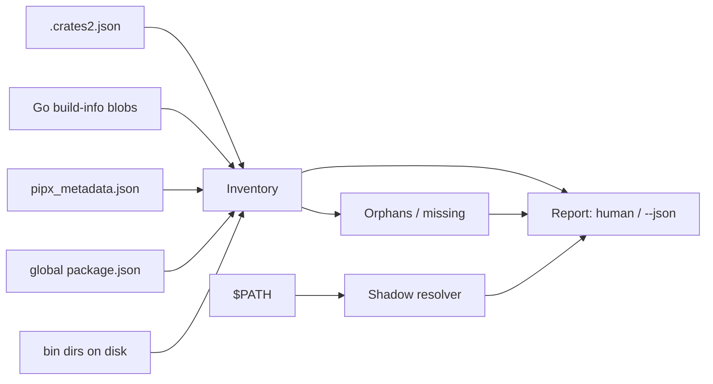

# binsweep

[English](README.md) | [中文](README.zh.md) | [日本語](README.ja.md)

[](LICENSE) [](Cargo.toml)  [](CONTRIBUTING.md)

**开源的全局开发二进制清单工具，覆盖 cargo、go、pipx 与 npm —— 来源溯源、陈旧检测与 PATH 遮蔽检测，一份报告全搞定。**


```bash
git clone https://github.com/JaydenCJ/binsweep.git && cargo install --path binsweep
```

> 预发布：尚未上架 crates.io，请按上述方式从源码安装。零运行时依赖 —— 二进制只用标准库。

## 为什么选 binsweep？

多年的 `cargo install`、`go install`、`pipx install` 和 `npm i -g` 会把每位开发者的 bin 目录变成垃圾填埋场：没人记得装过的神秘可执行文件、指向已删除 venv 的启动器，以及同一工具的两个版本 —— PATH 里靠前的那个悄悄获胜。各家原生列表命令只看得见自己的孤岛 —— `cargo install --list` 对 npm 也装过的那个 `rg` 一无所知 —— 而且没有一个能告诉你*实际运行的是哪一个*。binsweep 读取四个生态系统本来就在维护的清单（`.crates2.json`、每个 Go 二进制内嵌的 build-info 数据块、`pipx_metadata.json`、`package.json`），与磁盘上实际存在的文件逐一核对，产出一份报告：每个二进制是谁装的、有多旧、哪些无人认领、谁遮蔽了谁。它只读 —— 从不写入、删除或联网。

|  | binsweep | 原生列表命令¹ | `which -a` | `ls` + 猜测 |
|---|---|---|---|---|
| 跨生态单份报告 | 支持 | 不支持（各管各的孤岛） | 不支持（只有名字） | 不支持 |
| 来源溯源（包、版本、渠道） | 支持 | 仅限自家生态 | 不支持 | 不支持 |
| 孤儿检测（无人认领的二进制） | 支持 | 不支持 | 不支持 | 手工 |
| 缺失检测（有记录无文件） | 支持 | 不支持 | 不支持 | 不支持 |
| PATH 遮蔽，胜者在前 | 支持 | 不支持 | 仅列出现处 | 不支持 |
| 陈旧标记 | 支持（`--stale 1y`） | 不支持 | 不支持 | 盯着 `ls -l` 眯眼看 |
| 需要装齐各工具链 | 不需要 —— 直接读文件 | 需要（每一个） | 不需要 | 不需要 |
| 机器可读输出 | 支持（`--json`） | 参差不齐 | 不支持 | 不支持 |

<sub>¹ `cargo install --list`、`go version -m`、`pipx list`、`npm ls -g` —— 四条命令、四种格式，且 `go version -m` 要求机器上装有 Go 工具链。已对照 cargo 1.79 / go 1.22 / pipx 1.6 / npm 10 的输出验证，2026-07。</sub>

## 特性

- **四个生态，一份报告** —— cargo、Go、pipx 与 npm 的全局安装一次扫完，每个二进制都归属到它的包、版本与渠道（`crates.io`、`git`、`path`、模块路径、venv、registry）。
- **不装 Go 也能溯源 Go** —— binsweep 直接从文件字节解码 Go 链接器嵌入每个可执行文件的 build-info 数据块，即使机器上没有 Go 工具链，`~/go/bin` 也能拿到模块路径与版本。
- **孤儿点名示众** —— 无清单认领的可执行文件、指向已删 pipx venv 的启动器、包已被移除的 npm 链接，以及在 `~/.local/bin` 里石化的无主脚本，全部连同原因一一列出。
- **遮蔽不止列出，还给出裁决** —— 在多个 PATH 目录中同名的每个命令都按胜者在前报告，`binsweep which <name>` 解释一个名字的所有提供方，包括已安装但 PATH 够不到的那些。
- **陈旧阈值由你定** —— `--stale 90d`/`6mo`/`1y` 标记超过阈值未动过的二进制；时钟偏差造成的未来 mtime 永不计入。
- **安全且可脚本化** —— 设计上只读，无网络、无遥测；`--json` 供机器消费，`--strict` 让 CI 或 dotfile 检查在出现孤儿、缺失或遮蔽时以 1 退出。

## 快速上手

安装（需要 Rust 1.75+）：

```bash
git clone https://github.com/JaydenCJ/binsweep.git && cargo install --path binsweep
```

清扫你的机器，标记一年没动过的东西：

```bash
binsweep scan --stale 1y
```

输出（取自随附的 fixture —— `bash examples/fixture.sh`）：

```text
cargo · /tmp/binsweep-fixture/home/.cargo/bin — 3 binaries, 2 packages
  NAME    PACKAGE   VERSION ORIGIN    AGE STATUS
  gone    gone-tool 0.3.0   crates.io -   missing
  mystery ?         ?       ?         40d orphan
  rg      ripgrep   14.1.0  crates.io 2y  ok, stale

go · /tmp/binsweep-fixture/home/go/bin — 2 binaries, 1 package
  NAME     PACKAGE             VERSION ORIGIN               AGE   STATUS
  gotool   example.test/gotool v1.6.0  go module (go1.22.4) 300d  ok
  handcopy ?                   ?       ?                    3y 1d orphan, stale

pipx · /tmp/binsweep-fixture/home/.local/bin — 2 binaries, 1 package
  NAME           PACKAGE VERSION ORIGIN    AGE STATUS
  black          black   24.4.2  pipx venv 25d ok
  deploy-2019.sh ?       ?       ?         6y  orphan, stale

npm · /tmp/binsweep-fixture/home/.npm-global/bin — 2 binaries, 1 package
  NAME     PACKAGE    VERSION ORIGIN     AGE STATUS
  tsc      typescript 5.5.3   npm global 80d ok
  tsserver typescript 5.5.3   npm global -   missing

orphans (3)
  cargo /tmp/binsweep-fixture/home/.cargo/bin/mystery — present in bin dir but no cargo install record
  go    /tmp/binsweep-fixture/home/go/bin/handcopy — no Go build info — not built by 'go install'
  pipx  /tmp/binsweep-fixture/home/.local/bin/deploy-2019.sh — file in bin dir with no known package owner

missing (2)
  cargo gone — registered by 'gone-tool' but absent from /tmp/binsweep-fixture/home/.cargo/bin
  npm   tsserver — declared by 'typescript' but not linked in /tmp/binsweep-fixture/home/.npm-global/bin

shadows (1)
  rg: /tmp/binsweep-fixture/home/.cargo/bin/rg wins; shadowed: /tmp/binsweep-fixture/sysbin/rg

summary: 7 binaries · 5 packages · 3 orphans · 2 missing · 1 shadowed name · 3 stale
```

查询单个名字 —— 谁提供它、实际跑的是哪份拷贝：

```bash
bash examples/fixture.sh which rg
```

```text
rg — 2 places on PATH
  1. /tmp/binsweep-fixture/home/.cargo/bin/rg  ← active  (cargo · ripgrep 14.1.0)
  2. /tmp/binsweep-fixture/sysbin/rg  shadowed
```

## 事实从哪里来

binsweep 从不猜测：报告中的每一条断言都读自各生态系统自己维护的状态，再与 bin 目录逐一核对。

| 生态系统 | 事实来源 | 渠道取值 |
|---|---|---|
| cargo | `$CARGO_HOME/.crates2.json`（回退 `.crates.toml`） | `crates.io`、`registry`、`git`、`path`、`rustup proxy` |
| go | `$GOBIN` 中每个可执行文件内嵌的 build-info 数据块 | `go module (goX.Y.Z)` |
| pipx | `$PIPX_HOME/venvs` 中每个 venv 的 `pipx_metadata.json` | `pipx venv` |
| npm | `<prefix>/lib/node_modules` 中每个包的 `package.json` | `npm global` |

每条记录都带状态：`ok`（有认领且在磁盘上）、`orphan`（在磁盘上但无人认领）、`missing`（有认领但文件已消失）。Go 1.18 之前构建的二进制使用 binsweep 不去追踪的指针式编码；它们会以 `?` 字段如实报告，绝不张冠李戴。两类噪音在设计上就被消除：rustup 放在 `~/.cargo/bin` 里的工具链代理（`cargo`、`rustc` 等）会归属到 `rustup` 而不是被标为孤儿；互为别名的 PATH 目录（usr-merge 发行版上的 `/bin` → `/usr/bin`）会在遮蔽分析前去重。

## 选项与退出码

根目录按 命令行旗标 → 各工具自己的环境变量 → 惯例 解析，与各工具本身的行为完全一致。

| Key | Default | Effect |
|---|---|---|
| `--home <DIR>` | `$HOME` | 锚定所有惯例默认值的家目录 |
| `--path <PATH>` | `$PATH` | 用于遮蔽分析与 `which` 的 PATH 字符串 |
| `--cargo-home <DIR>` | `$CARGO_HOME` 或 `~/.cargo` | 要读取的 cargo home |
| `--go-bin <DIR>` | `$GOBIN`、`$GOPATH/bin` 或 `~/go/bin` | 要读取的 Go bin 目录 |
| `--pipx-home <DIR>` | `$PIPX_HOME` 或 `~/.local/share/pipx` | pipx home（自动识别旧版 `~/.local/pipx`） |
| `--pipx-bin <DIR>` | `$PIPX_BIN_DIR` 或 `~/.local/bin` | pipx 启动器目录 |
| `--npm-prefix <DIR>` | `$NPM_CONFIG_PREFIX` 或 `~/.npm-global` | npm 全局 prefix |
| `--stale <DUR>` | 关闭 | 标记早于 `DUR` 的二进制（`h`、`d`、`w`、`mo`、`y`） |
| `--json` | 关闭 | 机器可读报告（仅 scan） |
| `--strict` | 关闭 | 出现任何孤儿、缺失或遮蔽时以 1 退出 |

退出码：`0` 干净，`1` `--strict` 有发现或 `which` 一无所获，`2` 用法错误。

## 架构



## 路线图

- [x] 核心清扫：cargo/go/pipx/npm 溯源、孤儿与缺失检测、PATH 遮蔽、陈旧标记、JSON 报告、`--strict` 退出码
- [ ] 增加 Homebrew 与 uv tool 生态支持
- [ ] `binsweep clean` —— 交互式移除确认过的孤儿（默认仍然只读）
- [ ] 通过完整的 ELF/Mach-O 节遍历解析 Go 1.18 之前的指针式 build info
- [ ] Windows 支持（`PATHEXT`、`;` 分隔符、`%APPDATA%` npm prefix）

完整列表见 [open issues](https://github.com/JaydenCJ/binsweep/issues)。

## 贡献

欢迎贡献 —— 参见 [CONTRIBUTING.md](CONTRIBUTING.md)，可以从 [good first issue](https://github.com/JaydenCJ/binsweep/issues?q=is%3Aissue+is%3Aopen+label%3A%22good+first+issue%22) 入手，或发起一个 [discussion](https://github.com/JaydenCJ/binsweep/discussions)。

## 许可证

[MIT](LICENSE)
